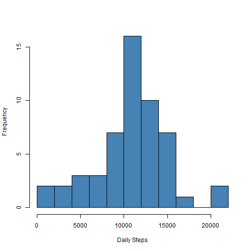
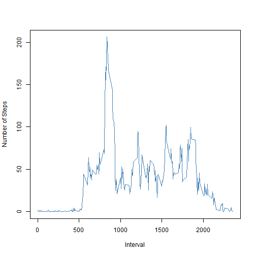
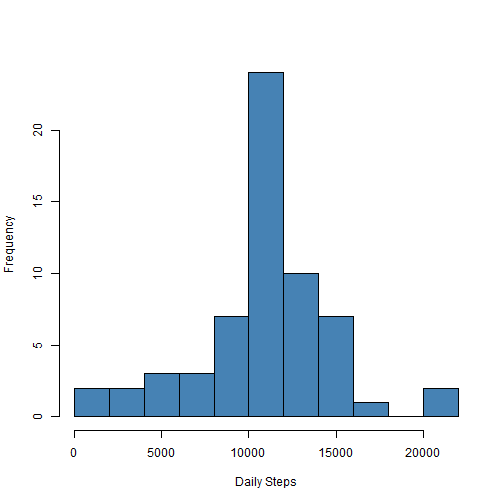
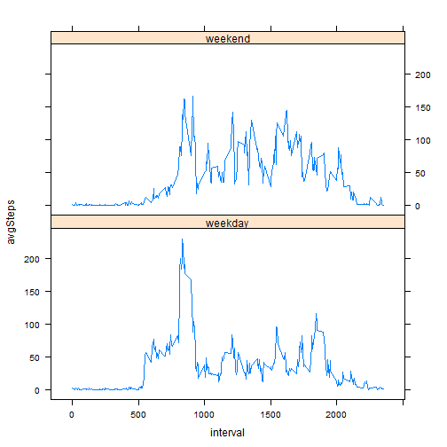

# Reproducible Research: Peer Assessment 1


## Loading and preprocessing the data
We'll start by reading the data from the CSV file, correcting the date field :


```r
unzip("activity.zip")
data <- read.csv("activity.csv", stringsAsFactors=F)
data$date <- as.Date(data$date)
```

Some quick over view over the data :


```r
str(data)
```

```
## 'data.frame':	17568 obs. of  3 variables:
##  $ steps   : int  NA NA NA NA NA NA NA NA NA NA ...
##  $ date    : Date, format: "2012-10-01" "2012-10-01" ...
##  $ interval: int  0 5 10 15 20 25 30 35 40 45 ...
```

```r
summary(data$interval)
```

```
##    Min. 1st Qu.  Median    Mean 3rd Qu.    Max. 
##       0     589    1180    1180    1770    2360
```

```r
summary(data$steps)
```

```
##    Min. 1st Qu.  Median    Mean 3rd Qu.    Max.    NA's 
##     0.0     0.0     0.0    37.4    12.0   806.0    2304
```

Let's clean the missing values and aggregate day by day :


```r
cleanData <- data[complete.cases(data),]
aggrCleanData <- aggregate(list(totalSteps = cleanData$steps), by=list(date = cleanData$date), sum)
```

## What is mean total number of steps taken per day?

```r
options(scipen=999)
hist(aggrCleanData$totalSteps, breaks = 10, xlab="Daily Steps", main="", col="steelblue")
```

 

For the distribuition the mean is 10766 steps per day. The median value is 10765 steps per day. 15264 rows where used in this distribution.

## What is the average daily activity pattern?

```r
avgCleanData <- aggregate(list(avgSteps = cleanData$steps), by=list(interval = cleanData$interval), mean)
plot(avgCleanData, type="l", xlab = "Interval", ylab="Number of Steps", col="steelblue")
```

 

The 835 interval is where on average an higher number of steps is records, with an average of 206.17 steps recorded.

## Imputing missing values

Not all steps information is available on the original dataset. 2304 records have missing step count information.

To carry on our study, will need to complete this missing information. The used approach will be to consider the average value for the interval with the missing data.


```r
recover <- merge(data, avgCleanData, by.x ='interval', by.y ='interval')
recover$steps <- ifelse(is.na(recover$steps), recover$avgSteps, recover$steps)
```

After these steps 0 have missing steps information.


```r
aggrAllData <- aggregate(list(totalSteps = recover$steps), by=list(date = recover$date), sum)
hist(aggrAllData$totalSteps, breaks = 10, xlab="Daily Steps", main="", col="steelblue")
```

 

The new distribution, with 17568 rows, has a mean of 10766 steps per day. The new median value is 10766 steps per day. This means that using a complete dataset, with a number of steps estimated where information was not available, had no effect on the mean value of the daily number of steps. The median value suffered a small change, increasing in 1 step per day.

## Are there differences in activity patterns between weekdays and weekends?

We create a lattice chart comparing the Weekdays and Weekend average values.


```r
recover$wday <- factor(ifelse(as.POSIXlt(recover$date)$wday %in% c(0,6), 'weekend', 'weekday'))
wData <- aggregate(list(avgSteps = recover$steps), by=list(interval = recover$interval, wday = recover$wday), mean)

library("lattice")
xyplot(avgSteps~interval|wday, data=wData, type="l", layout=c(1,2))
```

 

As we can see, on the weekend the average number of steps is more or less consistent along the active time of the day. On weekdays, there is a clear peak on the beggining of the active hours of the day, dropping to a lower value as the day goes by.
